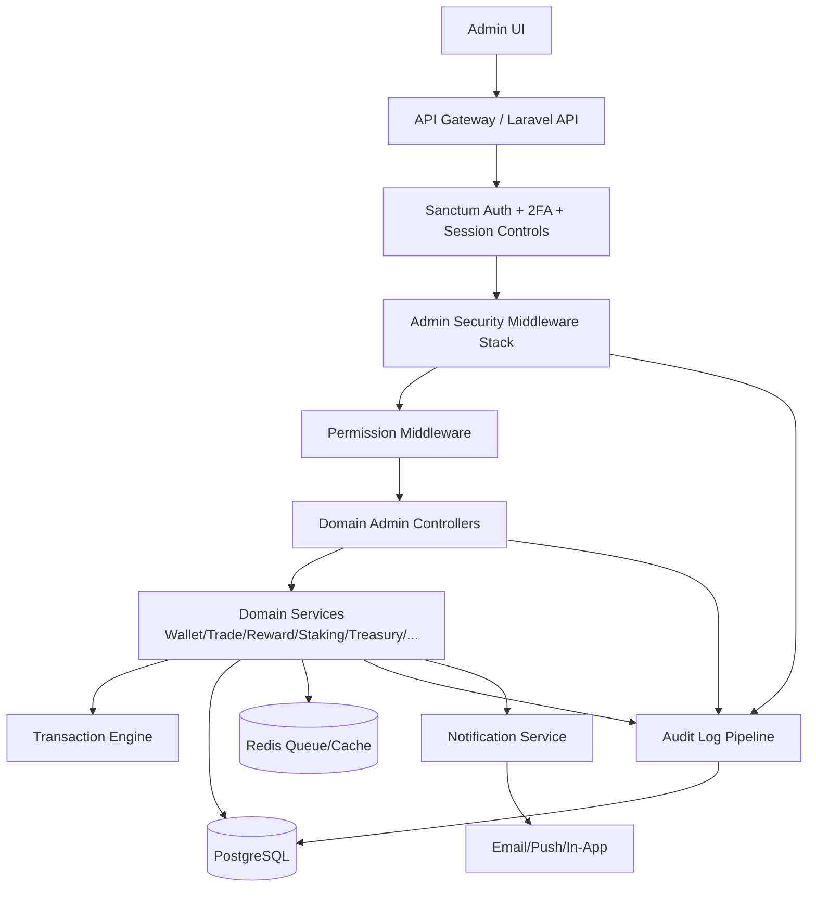

# ExaEarn Admin Dashboard Backend — Exchange-Grade Architecture Blueprint

## 1) Objective

Build a secure, audited, role-based admin backend for ExaEarn using [`Laravel`](exaearn-backend/composer.json), [`Sanctum`](exaearn-backend/composer.json), [`PostgreSQL`](exaearn-backend/.env.example), and [`Redis`](exaearn-backend/.env.example), covering:

- users
- wallets
- trading
- rewards
- staking
- NFT
- AgriTech
- EdTech
- sports pool
- crowdfunding
- lottery
- giftcard
- campaigns
- treasury
- logs
- notifications
- roles/permissions
- settings/security

Non-negotiables:
- strict RBAC/permission checks
- immutable auditability of admin actions
- high assurance auth/session controls
- no direct balance mutation outside transaction engine

---

## 2) Existing Baseline in Current Backend

Already present in [`routes/api.php`](exaearn-backend/routes/api.php:345):

- admin route groups with [`admin.security`](exaearn-backend/routes/api.php:345) and [`admin.audit`](exaearn-backend/routes/api.php:345)
- treasury admin endpoints in [`Route::prefix('admin/treasury')`](exaearn-backend/routes/api.php:386)
- settings admin endpoints in [`Route::prefix('admin/settings')`](exaearn-backend/routes/api.php:345)

Already present middleware:
- [`AdminSecurityLayer::handle()`](exaearn-backend/app/Http/Middleware/AdminSecurityLayer.php:15)
- [`AdminActionAuditMiddleware::handle()`](exaearn-backend/app/Http/Middleware/AdminActionAuditMiddleware.php:23)

This blueprint standardizes and extends these controls for full module coverage.

---

## 3) Target System Architecture

### 3.1 Middleware Stack Order (Admin Requests)
1. `auth:sanctum`
2. `admin.security` (IP/device/session/2FA posture)
3. `admin.audit` (request/response event log)
4. `check.permission:{permission_key}` per route
5. module-specific throttling/validation middleware

---

## 4) Data Model Blueprint

Core tables required:

1. `admins`
2. `roles`
3. `permissions`
4. `role_permissions`
5. `admin_sessions`
6. `admin_logs`

Recommended additional hardening tables:

7. `admin_action_approvals` (dual-control approvals for critical actions)
8. `admin_security_events` (2FA failures, unusual IP/device, lockouts)
9. `admin_login_challenges` (step-up/MFA verification challenges)
10. `admin_api_keys` (if machine-to-machine admin operations are needed)

### 4.1 Minimal schema details

- `admins`: `id`, `name`, `email` (unique), `password`, `role_id`, `status`, `two_factor_secret`, timestamps
- `roles`: `id`, `name` (unique)
- `permissions`: `id`, `name` (unique)
- `role_permissions`: `id`, `role_id`, `permission_id`, unique(`role_id`,`permission_id`)
- `admin_sessions`: `id`, `admin_id`, `token_id`, `ip`, `device`, `user_agent`, `last_seen_at`, `revoked_at`, timestamps
- `admin_logs`: `id`, `admin_id`, `action`, `resource`, `request_id`, `ip`, `device`, `status_code`, `data(jsonb)`, timestamps

---

## 5) Roles & Permission Model

Default roles:
- `super_admin`
- `admin`
- `moderator`
- `support`

Permission namespace pattern:
- `{module}.{action}`

Examples:
- `users.view`, `users.edit`
- `wallet.adjust`
- `trade.manage`
- `reward.manage`
- `staking.manage`
- `nft.manage`
- `agri.manage`
- `sports.manage`
- `edtech.manage`
- `crowdfunding.manage`
- `lottery.manage`
- `giftcard.manage`
- `campaign.manage`
- `treasury.manage`
- `logs.view`
- `settings.manage`
- `admins.manage`
- `roles.manage`
- `notifications.send`

Permission middleware contract:
- [`CheckPermission` middleware](exaearn-backend/app/Http/Middleware/AdminSecurityLayer.php:13) should verify role-linked permission grants and deny by default.

---

## 6) Admin Auth API Design

Required:
- `POST /admin/login`
- `POST /admin/logout`
- `GET /admin/me`

Implementation controls:
- issue Sanctum token with ability scope set
- capture IP + device fingerprint into `admin_sessions`
- log successful and failed logins to `admin_logs` and `admin_security_events`
- enforce 2FA before privileged operations
- revoke current token on logout + close session row

---

## 7) Module API Blueprint

## 7.1 User Management
- `GET /admin/users`
- `GET /admin/users/{id}`
- `POST /admin/users/freeze`
- `POST /admin/users/unfreeze`
- `POST /admin/users/adjust-balance` (must call `TransactionService`)
- `GET /admin/users/logs`
- `GET /admin/users/wallets`
- `GET /admin/users/trades`
- `GET /admin/users/rewards`

Required service invocation:
- `AuditService`
- `NotificationService`
- `TransactionService`

## 7.2 Wallet Admin
- `GET /admin/wallets`
- `POST /admin/wallets/freeze`
- `POST /admin/wallets/adjust` (via transaction engine only)
- `GET /admin/transactions`

Rule: no direct balance update query in controllers.

## 7.3 Trading Admin
- `GET /admin/pairs`
- `POST /admin/pairs`
- `PUT /admin/pairs`
- `POST /admin/pairs/disable`
- `GET /admin/orders`
- `GET /admin/trades`

Include trading pause circuit breaker.

## 7.4 Reward Admin
- `GET /admin/rewards`
- `POST /admin/rewards`
- `PUT /admin/rewards`
- `DELETE /admin/rewards`

Supported reward types: `checkin`, `referral`, `staking`, `campaign`, `bonus`, `mission`.

## 7.5 Staking Admin
- `GET /admin/staking/pools`
- `POST /admin/staking/pools`
- `PUT /admin/staking/pools`
- `POST /admin/staking/pools/disable`

Pool fields: `apr`, `lock_days`, `token`, `reward_token`, `status`.

## 7.6 NFT Admin
- `GET /admin/nft`
- `POST /admin/nft/approve`
- `POST /admin/nft/remove`
- `GET /admin/nft/sales`

## 7.7 AgriTech Admin
- `GET /admin/agri/projects`
- `POST /admin/agri/projects`
- `PUT /admin/agri/projects`
- `POST /admin/agri/projects/close`

Track funding + investors.

## 7.8 Sports Pool Admin
- `GET /admin/sports/athletes`
- `POST /admin/sports/approve`
- `GET /admin/sports/rewards`

## 7.9 EdTech Admin
- `GET /admin/courses`
- `POST /admin/courses`
- `PUT /admin/courses`
- `DELETE /admin/courses`
- `GET /admin/certificates`

## 7.10 Crowdfunding Admin
- `GET /admin/campaigns`
- `POST /admin/campaigns`
- `PUT /admin/campaigns`
- `POST /admin/campaigns/close`

## 7.11 Lottery Admin
- `GET /admin/lottery`
- `POST /admin/lottery`
- `POST /admin/lottery/draw`
- `GET /admin/lottery/winners`

Draw actions require fairness audit metadata.

## 7.12 Giftcard Admin
- `GET /admin/giftcards`
- `POST /admin/giftcards`
- `PUT /admin/giftcards`
- `POST /admin/giftcards/disable`

## 7.13 Treasury Admin (Critical)
- `GET /admin/treasury`
- `POST /admin/treasury/move`
- `POST /admin/treasury/approve-withdraw`
- `GET /admin/treasury/logs`

Hard controls:
- strict permission checks
- mandatory action confirmation
- dual control for high-risk move/approve-withdraw
- immutable logs on every step

## 7.14 Logs
- `GET /admin/logs`
- `GET /admin/admin-logs`
- `GET /admin/security-logs`

Pagination required; deletion prohibited.

## 7.15 Notifications
- `POST /admin/notifications/send`
- `GET /admin/notifications`

Channels: email, push, in-app.

## 7.16 Settings
- `GET /admin/settings`
- `PUT /admin/settings`

Domains: fees, limits, rewards, trading, staking, lottery, campaign.

---

## 8) Required Service Layer Contracts

Required services:
- `AuditService`
- `NotificationService`
- `WalletService`
- `TransactionService`
- `RewardService`
- `StakingService`
- `TradingService`
- `TreasuryService`
- `PermissionService`

Service design rules:
- controllers orchestrate only; business logic in services
- transactional boundaries in service methods
- domain events emitted for asynchronous side effects (notifications/log shipping)
- all sensitive service methods record audit events with `request_id`

---

## 9) Security Rules (Enforcement Matrix)

For every admin route enforce:
- permission middleware
- admin audit log middleware
- rate limiting
- IP logging
- device logging
- 2FA-aware checks
- session tracking

Financial integrity constraints:
- no direct balance edit
- no ad hoc DB write bypassing domain services
- all balance-impacting actions routed through transaction engine with ledger entries

---

## 10) Suggested Route Grouping Strategy in Laravel

Use route groups in [`routes/api.php`](exaearn-backend/routes/api.php:345):

- `Route::prefix('admin')->middleware(['auth:sanctum','admin.security','admin.audit'])->group(...)`
- nested group per module: `users`, `wallets`, `trade`, `rewards`, etc.
- per-route permission middleware e.g. `->middleware('check.permission:users.view')`

This aligns with existing admin grouping found in [`routes/api.php`](exaearn-backend/routes/api.php:386).

---

## 11) Delivery Plan (Phased)

### Phase 1 — Foundation
- finalize admin RBAC schema/migrations
- implement `CheckPermission` middleware
- harden admin auth/session + 2FA checks

### Phase 2 — Core Admin Modules
- users/wallets/transactions/trade/reward/staking controllers + services
- ensure all balance operations call `TransactionService`

### Phase 3 — Extended Domains
- NFT/agri/edtech/sports/crowdfunding/lottery/giftcard modules
- align permission matrix and audit coverage

### Phase 4 — Treasury & Controls
- dual-approval treasury flow
- risk throttles and emergency controls
- immutable security logs and security dashboard queries

### Phase 5 — Production Hardening
- load tests for admin endpoints
- penetration tests and abuse tests
- operational runbooks and incident drills

---

## 12) Hard Go-Live Security Gates

Do not launch until all pass:
- all admin endpoints are permission-guarded
- 100% admin actions audited with actor, action, outcome, metadata
- 2FA enforced for treasury, wallet adjust, settings mutate, role/permission changes
- no controller performs direct balance mutation
- treasury critical actions support confirmation and approval policy
- admin logs are queryable, paginated, append-only
- rate limit and anomaly detection active on auth/admin routes

---

## 13) Production-Ready Outcome

This blueprint provides an exchange-grade admin backend design that is:
- secure
- role based
- auditable
- modular
- scalable
- aligned with the existing ExaEarn Laravel structure.
